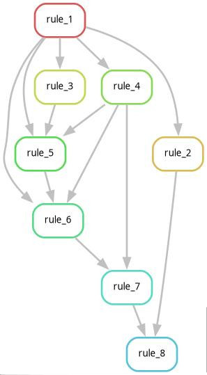
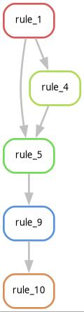
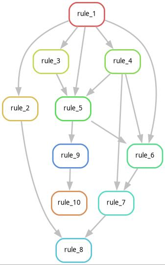

# 4. Branches and variables

In the previous part we saw how to build a simple two-rule system. However, our bioinformatics workflows usually involve more then two rules, which are not always connected in a linear way. In this part we'll get into how to organize our workflow into more complex patterns involving more rules, how to simplify how we specify our rules using variables and how to plot more complex workflows.

## Using variables in shell commands

When we look again at the shell command from **rule_1** from the previous part, we explicitely point to **file1.txt** twice. Once in the output part:
```
    output: "file1.txt"
```

and once in the shell part:
```
    shell: "touch file1.txt"
```
For the shell part, we can replace **file1.txt** with a variable, which points to **file1.txt** in the output part by changing the shell part in the following way:
```
    shell: "touch {output}"
```
Now the variable {output} in the shell script gets replaced by **file1.txt**, as it is defined in the output part of the rule. In general, inside the shell part different types of variables provided by Snakemake variables are defined by **{curly brackets}** around them. 


> [!CAUTION]
> Some shell commands you may want to include in your snakemake workflow use curly brackets on their own. For example consider the scripting language awk, where the command for plotting the first column of a tab separated file is like the following:
>
>awk '{print $1}' file.tsv
>
>If we want to use such a command in the shell part from Snakemake we have to **escape the curly brackets** by adding an extra pair of curly brackets around them, so that your snakemake shell command would look as follows:
>
>awk '**{{**print $1**}}**' file.tsv

Using such variables in your shell commands is generally strongly recommended. In many cases your input files may be complete paths or, as we will see later, will be generated by specific Snakemake functions and using variables will make your code much more readable. It will also reduce the probability of introducing coding errors if you have to define a file only once and then refer to it using variables.

Besides the {output} variable there is also a variable for {input}, which works the same way. So if we consider the shell part of **rule_2** from the previous part
```
    shell: "cp file1.txt file2.txt"
```
We can also change it to
```
    shell: "cp {input} {output}"
```
## Multiple input and output files

So far all of our rules had at most one input file and one output file. However, many of our bioinformatics software packages have multiple input files and we can often generate multiple output files with a single command. To accomodate this, rules can have an arbitrary number of input and output files. Lets assume we want to make a new rule called **rule_3**, which depends on the output files of both **rule_1** and **rule_2**, **file1.txt** and **file2.txt** and generates an output file called **file3.txt** by concatenating both files using the **cat** command. We could define it like this: 

```
rule rule3:
    input: 
        "file1.txt",
        "file2.txt"
    output: "file3.txt"
    shell: "cat {input} > {output}"
```

Note that in the output part we are now writing **file1.txt** and **file2.txt** in new lines instead of next to the output part. Also note that both of these lines have an additional level of indentation, e.g. there is an additional tab or set of multiple spaces at the beginning of the line, which tells Snakemake that both lines belong to the input part, while the output part in the following line goes back one level of indentation. Finally note the comma after **file1.txt**. 
> [!CAUTION]
> If we define these types of multi-line variables we have to separate them with commas. **Forgetting these commas is one of the most common mistakes I make when writing Snakemake workflows!**

## Named input and output variables

In the previous shell part we used the {input} variable to point to the input part, which consisted of two files, **file1.txt** and **file2.txt**. In such a case the {input} variable will be replaced by both files separated by spaces, so that in the end the actual command that is run after the variables are replaced will be as follows:

```
cat file1.txt file2.txt > file3.txt
```

This makes sense for a command like cat, where we can just list any number of files that will then get concatenated. However, in most situations where we have multiple input or output files we want to use one file in a specific part of our shell command and another one in a different part. For this purpose we can give these files names and specifically address them using input or output variables. We can change **rule_3** in the following way to name our input variables

```
rule rule3:
    input: 
        f1="file1.txt",
        f2="file2.txt"
    output: "file3.txt"
    shell: "cat {input.f2} {input.f1} > {output}"
```

We can name variables by putting an arbitrary name (again no whitespace or special characters) and an equal sign before defining each file and we can then access that file by adding a dot and that name to each shell variable inside the curly brackets. Note that by accessing the files specifically, we changed the order in which cat will concatenate both files, so that the content of **file2** will now be on top of the content of **file1** in the output file and the shell command that will be run is as follows

```
cat file2.txt file1.txt > file3.txt
```

## Building complex workflows

Now that we can define rules with multiple input and output files we already have tools at hand that allow us to build some pretty complex workflows. In the following part we will explore how these more complex workflows are resolved and run by Snakemake and how we can visualize them to keep the overview over our workflows.

For this part we will be looking at a more complex Snakefile I put [in the scripts folder](scripts/04_branches_and_variables/Snakefile).

As explained before, you can download it directly using **wget** and the raw file from Github with the following command


```
wget https://github.com/jgerchen/snakemake-course/raw/refs/heads/main/scripts/04_branches_and_variables/Snakefile 
```

Now lets have a look at our Snakefile. We see that there are ten rules with various dependencies between each other. **However, their order seems to be all messed up!** Reconstructing which rule depends on which other rule would be quite an undertaking if we do it by hand.

Or we can just ask Snakemake to do it for us. Let's assume we want to generate **file8.txt**, the output of **rule_8**. We can just ask Snakemake to list us what it **would do** if we ask it to create **file8.txt**. To do this we can tell Snakemake to do a **dryrun** by adding the **-n** option. So if we are in the same folder as our new Snakefile we can do this by running

```
snakemake -n file8.txt
```
With this command Snakemake will list all the rules it will run if we remove the **-n** parameter and ask it to run our job in ernest. Also we can leave out the number of jobs defined by the -j1 parameter, because a dry run implies that we will not actually run any jobs.

> [!important]
> Doing dry runs can be really useful to ensure if Snakemake will really do what you think it should do. When I develop more complex workflows with computationally intensive jobs I always do dry runs to check if everything will be run as I expect it.

Also note that Snakemake automatically ordered the rules **despite their order being completely mixed up!**

> [!important]
> Snakemake doesn't care about the order of your rules in your Snakefile. The only thing that matters are the dependencies between rules, which will define the order in which files are run.

## Plotting our Snakemake jobs visually

Another way of asking Snakemake what it would do if we ask it to generate a specific file is to tell it to generate a plot of dependencies. To do this we have to add the option --dag, which outputs a plot in the dot file format format. Currently there is an unresolved bug in Snakemake which adds an additional output line at the head of the output, which confuses programs that can plot dot files, so we have to do a bit of a hacky workaround to get a working file. For output **file8.txt** we can generate the dot file in the following way:

```
snakemake -n file8.txt --dag | tail -n +2 > graph.dot
```

Here we redirect the output of the Snakemake command into the **tail** command, which we use to remove the first line and redirect its output into the file **graph.dot**.

We can turn the dot file into an image file using the graphviz software, which we can install into our Snakemake conda environment using the following command

```
mamba install graphviz
```

Now we can use the **dot** command to plot our graph in jpeg format in the following way

```
dot -T jpg graph.dot > graph.jpg
```

Or if we're lazy we can do it without the intermediate dot file by using additional pipes

```
snakemake -n file8.txt --dag | tail -n +2 | dot -T jpg > graph.jpg
```

In both cases we get a visual representation of dependencies between rules as follows



When we look at this plot we can see that it contains only 8 out of the total 10 rules in the Snakefile. For example we don't see **rule_9** and **rule_10** in the plot. This is because **rule_8** does not depend on them and we only asked Snakemake to create its output **file8.txt**.

Now let's try to generate **file_10**, which is the output of **rule_10**, which we also haven't seen in the previous plot. However, if we ask Snakemake to do a dry run to see if it can generate it using the following command:

```
snakemake -n file10.txt
```

We get an error message like this:

>Missing input files for rule rule_9:
>   output: file9.txt
>   affected files:
>       file2.txt

If we look into the Snakefile we can see that both rule_9 and rule_2 depend on **file_2.txt**, but there is no rule that can generate **file_2.txt**. This may be an error that was made when building the workflow. However, it could also mean that **file_2.txt** is not supposed to be generated by a rule, but it may be an input file that has to exist before the workflow is run. In the second case we can fix this issue by generating **file2.txt** in the same folder as the Snakefile using 

```
touch file2.txt
```

Now if we redo the dry-run for **file10.txt** it will work and print the rules it will run. We can also plot its graph using

```
snakemake -n file10.txt --dag | tail -n +2 | dot -T jpg > graph2.jpg
```
And we get the following plot



Now lets assume we want to generate both **file_8.txt** and **file_10.txt** at the same time. We can do this by simply giving multiple both files to the Snakemake command. Also, both **file_8.txt** and **file_10.txt** depend on the output of some of the same rules (**rule_1**,**rule_2**,**rule_3**,**rule_4** and **rule_5**) Snakemake will understand this and will run those rules only once and decide on the most reasonable order to do that. For doing a dry run for both **file_8.txt** and **file_10.txt** run

```
snakemake -n file8.txt file10.txt
```

And it will tell us that it would run all 10 rules. If we plot the graph like this

```
snakemake -n file8.txt file10.txt --dag | tail -n +2 | dot -T jpg > graph3.jpg
```

We get something that borders both science and art like this



## How does Snakemake resolve workflows?

In the previous part we saw that Snakemake can resolve complex dependencies between rules. Now let's try to understand a bit better how it does this.

+ In a first step Snakemake builds a **directed acyclical graph (DAG)** based on file dependencies defined by the input and output of rules. It does this by starting at the end of the graph (the file you tell Snakemake to generate) and then follows the dependencies backwards until all dependencies are resolved.

## Your turn: Slimulating gene flow and making a PCA and running Structure

Now for your part lets build something slightly less complicated, but much more useful in our slimulation framework.
