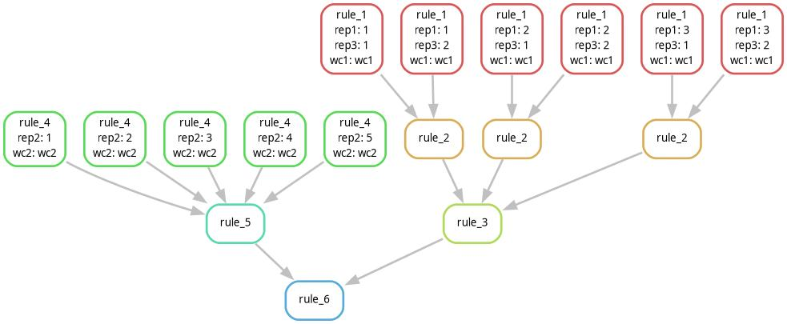
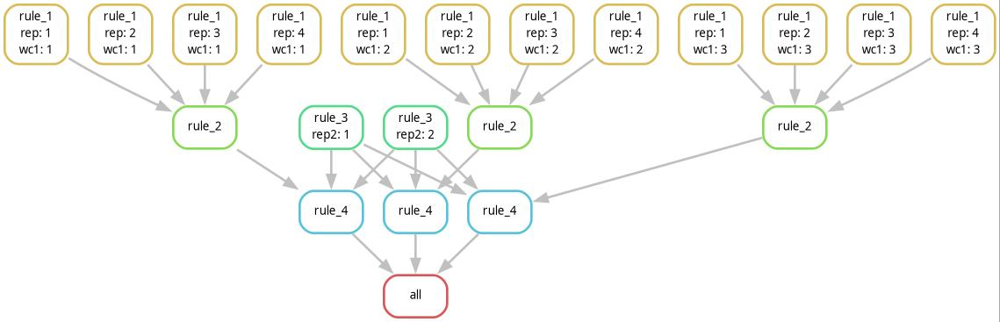
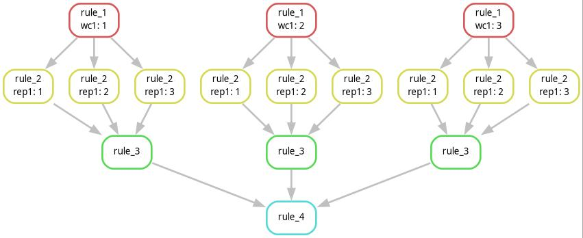

# 6. Expanding wildcards

In the previous part we already saw that a rule with a wildcard may be run multiple times if we ask Snakemake to create multiple output files with different values for that wildcard. In addition to that, a rule can also be run multiple times if a second rule will have several input files, which can be resolved with different values for that wildcard. Consider the following Scenario:


```
rule rule_1:
	output: "rule1_file{wc1}.txt"
	shell: "echo {wildcards.wc1} > {output}"

rule rule_2:
 	input: 
        "rule1_file1.txt",
        "rule1_file2.txt",
        "rule1_file3.txt"
	output: "rule2_cat.txt"
    shell: "cat {input} > {output}"
```

If we tell Snakemake to generate **rule2_cat.txt** Snakemake will run rule_1 three times, because each of the three input files can be generated by replacing the wildcard **{wc1}** with different values, either 1, 2 or 3.

>[!IMPORTANT]
> Keep in mind that although it is **rule_1**, which is run three times, it is the input of **rule_2**, which determines this. Or more general, again it is the **dependencies from other rules which determine the values of wildcards**.

## Using the expand function instead

In the example above we explicitely defined each of the three input files, where the only difference is the value for wildcard **{wc1}**. Snakemake has a specific function that can generate such a list of input or output files, that only differ by the value of one or multiple wildcards. This is called the expand function and for **rule_2** from the previous example it would look as follows:

```
rule rule_2:
 	input: expand("rule1_file{wc}.txt", wc=[1,2,3])
	output: "rule2_cat.txt"
    shell: "cat {input} > {output}"
```

Note that here **{wc}** is not actually wildcard, but a variable that is only valid inside the expand function. We can use any name for these kind of expanded variables and we define what it should be replaced with after the string and a comma and equal sign. In this case we supply it with a python array containing the numbers 1,2 and 3.

>### :snake: Python objects usable in the expand function
> We can use different types of python objects for variable expansion in the expand function and for now I will show you only two examples: a python array and the range function. Above we used a python array containing the three integers 1,2 and 3. Arrays are functionally similar to vectors in R and are defined by square brackets and its elements are separated by commas. Arrays can contain different types of elements. While numeric elements can just by written as above, strings have to be surrounded by quotes, like in the following example:
>
> ["one","two","three"]
>
> As an alternative to writing a sequence of numbers by hand you can also use the range function to do it for you. If you supply it a single integer as below it will generate a sequence of numbers
>
> range(3)
>
> However, note that **numbers in Python are zero-based**, e.g. it will start counting at zero and range(3) will result in the numbers 0,1 and 2. If we want it to start at 1 we have to give it two parameters, our start and end point, which has to be one greater than the number we actually want. So to generate 1,2 and 3 we have to use
>
> range(1,4)

## Expanding multiple wildcards

Now let's throw a second wildcard **{wc2}** into the mix and also expand it using the expand function. Consider the following scenario

```
rule rule_1:
	output: "rule1_file{wc1}_{wc2}.txt"
	shell: "echo {wildcards.wc1} > {output}"

rule rule_2:
 	input: expand("rule1_file{wc_one}_{wc_two}.txt", wc_one=range(1,4), wc_two=["one","two"])
	output: "rule2_cat.txt"
    shell: "cat {input} > {output}"
```

As you can see we can expand multiple variables using the expand function. We expanded **wc_one** using python's range function and **wc_two** using an array of two strings. In this situation the expand function will generate all combinations of both variables, resulting in 6 output files instead of three.

## Escaping wildcard expansion

In the previous lesson you learned that wildcards can propagate through multiple levels of our workflow. We can also include such regular wildcards in your expand function. Consider the following scenario: 

```
rule rule_1:
	output: "rule1_file{wc1}_{wc2}.txt"
	shell: "echo {wildcards.wc1} > {output}"

rule rule_2:
 	input: expand("rule1_file{wc_one}_{{wc2}}.txt", wc_one=range(1,4))
	output: "rule2_cat_{wc2}.txt"
    shell: "cat {input} > {output}"
```

Now only **{wc_one}** gets expanded by the expand function while **{wc2}** acts as a regular wildcard, which gets determined by the output file of **rule_2**. So if we ask Snakemake to generate **rule2_cat_new.txt**, rule will generate its dependencies, **rule1_file1_new.txt**,**rule1_file2_new.txt**,**rule1_file2_new.txt** and only the value of **wc1** gets determined by expansion. We do this by using a double set of curly braces in the expand function, which tells Snakemake that **wc2** should act like a regular wildcard and not be expanded.

I hope you can see that the expand function can be very useful for creating for example replicate runs of simulations or other software.

## Exercise: build some complex graphs using wildcards

To make sure that you understand how wildcards work, here I propose an exercise: I show you plots of three graphs and you are supposed to reconstruct them by writing Snakefiles using the features we learned in the previous lessons. You can keep the shell part of your rules as simple as you like, for example by just using **touch**, as I did in the previous examples, the important part in this exercise is to understand how rules are connected using wildcards.

### Exercise workflow 1:

Use no more than 6 rules!



### Exercise workflow 2:

Use no more than 4 rules and the all rule!



### Exercise workflow 3:

Use no more than 4 rules!



## Your turn: modify your workflow to run multiple replicate structure runs and summarize and plot their results

In many publications that use Structure you'll see that people often use multiple replicate structure runs and generate a consensus between results. The issue with generating consensus Structure runs is that Structure arbitrarily assigns cluster identities, so clusters be swapped between runs. 

This problem can be solved by using the clustering software clumpp, which will find a consensus between replicate structure runs and generate mean assignment probabilities based on it. For this task your job is to implement replicate structure runs using the expand functioni, merge them using clumpp and plot the merged results. At the same time you want to keep the ability to generate replicate runs based on the wildcards you provide, so the replicate structure runs should be specific for each combination of wildcards and also end up in appropriate folders. To do this you'll need the following ingredients:

- [This python script](scripts/06_expand_functions/make_clumpp_input.py) is used for merging multiple output files of structure and generating input files for CLUMPP. It is pure python and has no additional dependencies. Parameters for output files are -p and -i, which are the parameter file and input file for CLUMPP, repsectively and -s is the beginning of the name that is shared by all structure output files you want to merge (so for example **struct_out** if your output files are called **struct_out_1_f**, **struct_out_2_f**, ...)

```
python3 make_clumpp.py -p clummp_parameters -i clump_ind_file -s struct_out
```

- [CLUMPP](https://rosenberglab.stanford.edu/clumpp.html): A software package for clustering multiple structure runs. A conda package is [available on the **ipyrad channel**](https://anaconda.org/channels/ipyrad/packages/clumpp/overview). Clumpp is run with the paramfile generated by the python script above as parameter as follows

```
CLUMPP paramfile
```

The paramfile also contains the name of the indfile you gave as parameter to the script above and it will generate two output files, both named based on the -s parameter you gave in the python script above: the clummp output file which ends with **.out** and a misc file, which ends with **.misc** (so **struct_out.out** and **struct_out.misc** respectively if you used struct_out for -s as in the example above)

- [This R script](scripts/06_expand_functions/plot_structure_clumpp.R) used for plotting clumpp output. It also depends on the r-viridis library, which should already be installed. It is run as the script for plotting individual structure runs from the previous session, the only difference is that it takes clummp output insteat of structure 

